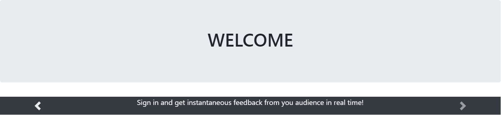
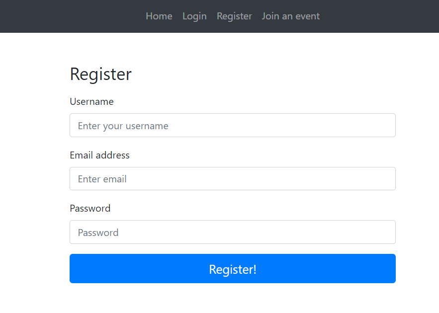

# Continuous feedback
This is a team project made for WEB class. The objective of this app is to enable users to provide real time feedback to a course.
## Available features
* As a professor i can define an activity at a particular date, with a description and a unique access code for the activity. The activity is accessible for a set period of time.
* As a student, i can input a code to participate in a defined activity. The code can be used for the duration of the activity.
* As a student who has accessed an activity I have access to an interface split into 4 rectagles each containing an emoticon (smiley face, frowny face, surprised face, confused face). At any time i can press an emoticon to react to the activity. As a student I can add an unlimited number of feedback instances.
* As a professor I can see the continuous feedback stream, with each feedback instance associated to the time it was generated at. I can only see the feedback as anonymous. For myself the feedback is available both during and after the activity.
## How to run this app?
To run this app you must write into your terminal:
```
npm start
```
## How look this app?
Below you'll see welcome and registration pages.


